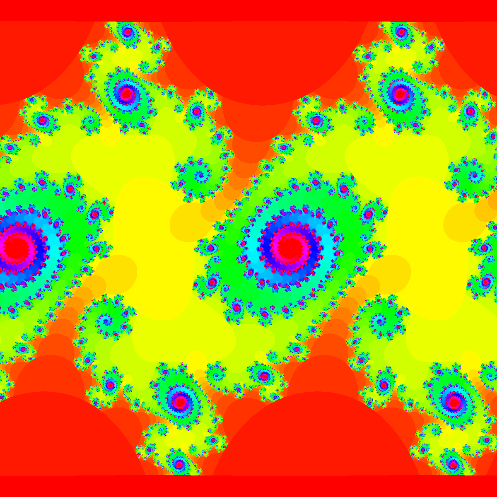
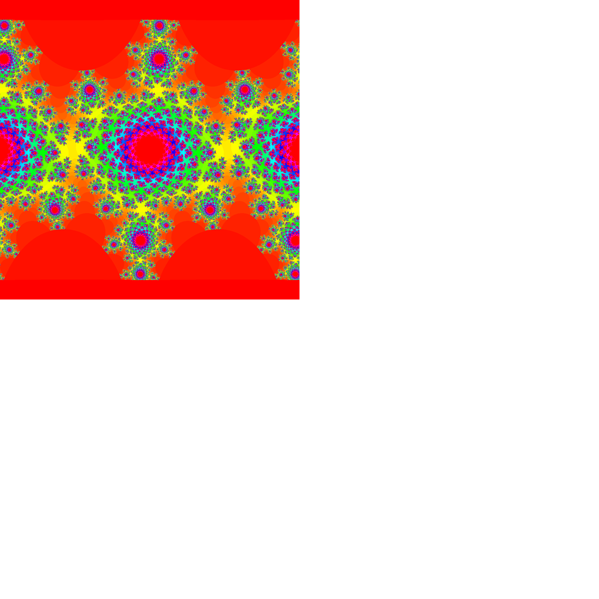

# [Fractal du Sinus Itéré](https://rotgers.io/posts/sinz_fractal/)

Dans ce cas, la fonction $f(z_n) = \sin(z_n) \cdot c$ où $c$ est un nombre complexe donné en paramètre et $z_0$
correspond à un pixel exprimé sous la forme d'un nombre complexe dans l'espace physique défini par le paramètre
global `range`.

On décide ici d'arrêter les itérations dès que $|z_n|^2 > 50$.

| Nom du type    | Description du type |
|----------------|---------------------|
| `IteratedSinZ` | `c: Complex`    |

| c =  1 + 0.3 *i*              | c = 0.2 + *i*                 |
|-------------------------------|-------------------------------|
|  |  |
