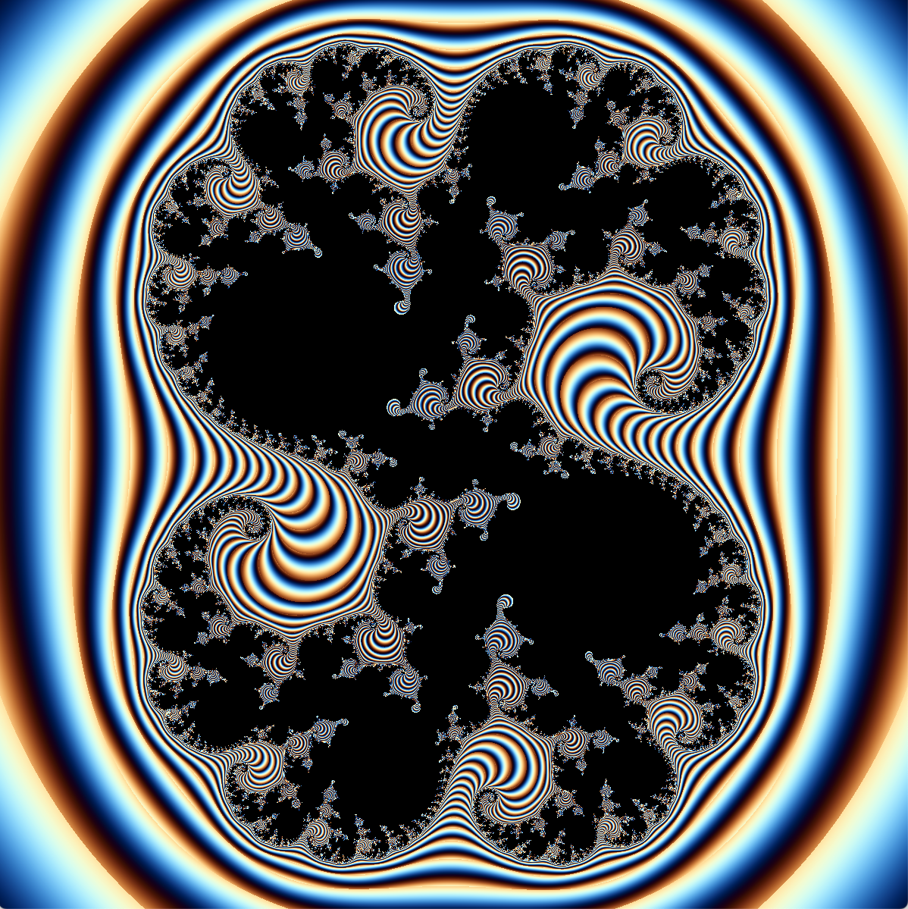
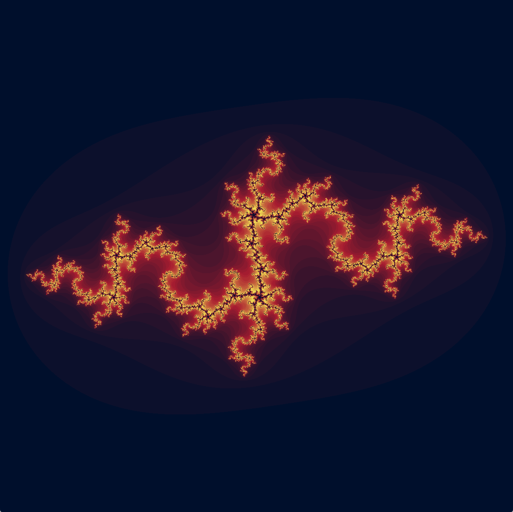

# Ensemble de [Julia](https://fr.wikipedia.org/wiki/Ensemble_de_Julia)

Dans ce cas, la fonction $f(z_n) = z_n^2 + c$ où $c$ est un nombre complexe donné en paramètre et $z_0$ correspond à un
pixel exprimé sous la forme d'un nombre complexe dans l'espace physique défini par le paramètre global `range`.

On décide ici d'arrêter les itérations dès que $|z_n|^2 > divergence_threshold_square$.

| Nom du type       | Description du type                                 |
|-------------------|-----------------------------------------------------|
| `JuliaDescriptor` | `c: Complex` `divergence_threshold_square: f64` |

| c =  0.285 + 0.013 *i* | c = -0.9 + 0.27015 *i* |
|------------------------|------------------------|
|  |  |
