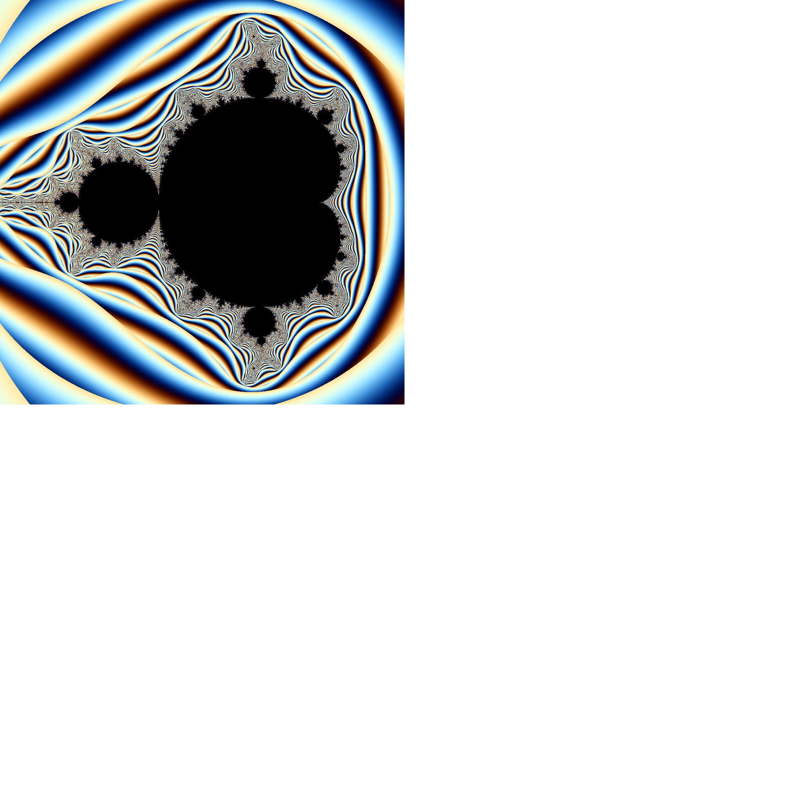

# Ensemble de [Mandelbrot](https://en.wikipedia.org/wiki/Mandelbrot_set)

Dans ce cas, la fonction $f(z_n) = z_n^2 + c$ où $z_0=0$ et $c$ est un nombre complexe correspondant à un
pixel exprimé sous la forme d'un nombre complexe dans l'espace physique défini par le paramètre global `range`.

On décide ici d'arrêter les itérations dès que $|z_n|^2 > 4$.

| Nom du type  | Description du type |
|--------------|---------------------|
| `Mandelbrot` | (aucun champ)       |

| Un grand classique         |
|----------------------------|
|  |
