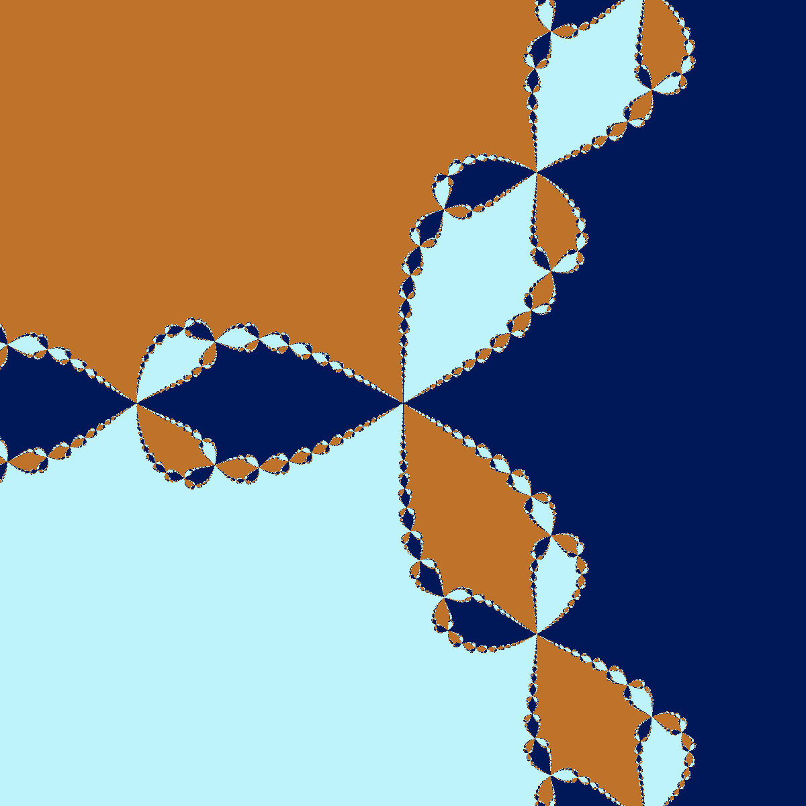
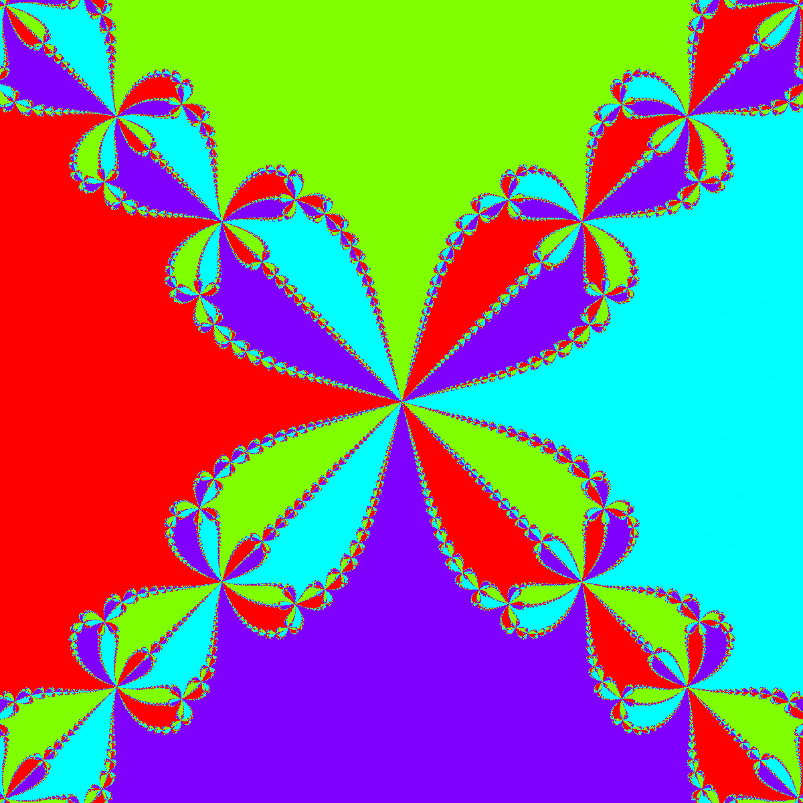

# [Newton fractals](https://en.wikipedia.org/wiki/Newton_fractal)

Dans ce cas, la fonction $f(z_n) = z_n - \frac{p(z_n)}{p'(z_n)} + c$ où $p(z)$ est une fonction polynomiale, $z_0=1$, et
$c$ correspond à un pixel exprimé sous la forme d'un nombre complexe dans l'espace physique défini par le paramètre
global `range`.

On décide ici d'arrêter les itérations dès que $|z_{n+1}-z_n|^2 < 1e-6$.

| Nom du type       | Description du type |
|-------------------|---------------------|
| `NewtonRaphsonZ3` | (aucun champ)       |
| `NewtonRaphsonZ4` | (aucun champ)       |

| `NewtonRaphsonZ3`: $p(z)=z^3-1$ | `NewtonRaphsonZ4`: $p(z)=z^4-1$ |
|---------------------------------|---------------------------------|
|  |  |
